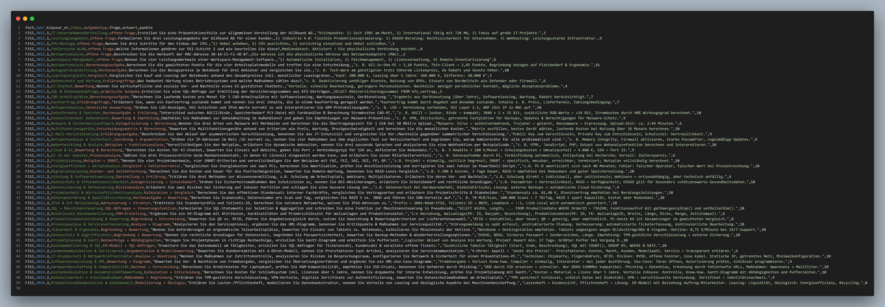
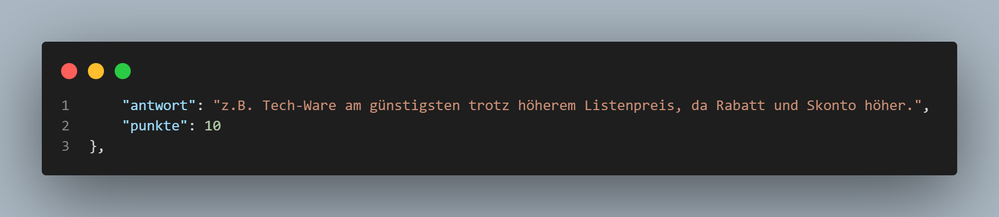

# AP1-LLM 
Ein KI-gestütztes Projekt zur Analyse, Prognose und Generierung von AP1-Prüfungsaufgaben für Fachinformatiker.

## Funktionen

- Konvertierung echter AP1-Prüfungen (Herbst/Frühling 2021-2025) in JSON
- ML-gestützte Analyse 
    - Klassifikation von Aufgaben nach Thema
    - Regression für die Vorhersage (z.B der erwartbaren Punktzahl)
- LLM-Generierung neuer, realistischer Prüfungsaufgaben (openai API)


## Start (Schritt für Schritt)
1. `.env` mit eigenem api key anlegen
```env
OPENAI_API_KEY=sk-32432324v32XX
```

2. .venv erstellen und Pakete installieren:
```bash
python -m venv .venv
.venv\Scripts\activate
pip install -r requirements.txt
```

3. Projekt starten mit Batch File oder manuell:
```bash
start_project.bat
```
Dadurch werden CSV-Dateien erzeugt (aus den JSON Files)

Diese werden für ML-Modelle(Klassifikation & Regression) genutzt
(Optional: Hauptfunktion = generierung neuer aufgaben)

---


## Beispiel: Generierte Aufgabe 

 

## Umgewandelt pdf Format

 

---


## Erläuterung der Machine Learning Modelle

### `train_model.py` 
- Lädt alle JSON-Dateien aus `converted_json`
- Wandelt sie in ein gemeinsames CSV-Format (`training_data.csv`) um
- Diese Datei kann/wird von ML-Modellen genutzt (z.B. evaluate_model.py)




### `classifier.py`
- Liefert RandomForest-Klassifikationsmodell
```python
return RandomForestClassifier(n_estimators=100, random_state=42)
```


### `regressor.py`
- liefert lineares Regressionsmodell (für die wahrscheinlichkeit der Themen)
```python
return LinearRegression()
```

### `evaluate_model.py`
- Lädt `training_data.csv`
- Vektorisiert die Fragen 
- Trainiert das klassifikationsmodell (z. B. für das Thema) 
- Bewertet Genauigkeit 

### `generate_exam.py`
-Arbeitet mit GPT-4 über openai API. GPT-3.5 ist technisch möglich, liefert für diesen Use Case aber zu ungenaue Ergebnisse(upscaling bei bedarf möglich)
- Fragt das modell, um realistische neue Prüfungsaufgaben zu generieren (ergebnis in converted_json file) 


---

## Modell-Auswertung & Metriken


### Klassifikation: Welches Thema gehört zur Aufgabe? 

| Metrik     | Bedeutung |
|------------|-----------|
| **Precision** | Wie viele der als Thema X vorhergesagten Aufgaben waren wirklich Thema X? |
| **Recall** | Wie viele der tatsächlichen Thema X-Aufgaben wurden korrekt erkannt? |
| **F1-Score** | Mittelwert aus Precision & Recall – nützlich bei unausgeglichenen Daten |
| **Support** | Anzahl der echten Aufgaben dieses Themas im Testdatensatz |
| **Accuracy** | (unabhängig vom Thema)Wie viele Aufgaben insgesamt korrekt klassifiziert wurden? |

---

### Regression: Wie viele Punkte wird eine Aufgabe wohl haben?

Die Regression (z. B. Lineare regression) versucht vorherzusagen, wie viele Punkte zu einer Aufgabe vergeben werden (z. B. 3, 5, 10 Punkte).  
Du brauchst dazu die Spalte `"punkte"` in deinen JSONs == diese wird ausgelesen, vektorisiert und ein Regressionsmodell darauf trainiert.



#### Metriken zur Bewertung:

| Metrik     | Bedeutung |
|------------|-----------|
| **MAE**    | Mean Absolute Error= Durchschnittlicher Fehler (z. B. im Schnitt 2 Punkte daneben) |
| **RMSE**   | Root Mean Squared Error= wie MAE, aber größere Fehler werden stärker gewichtet |
| **R²**     | R-squared = Erklärt, wie gut dein Modell ist: 1 = perfekt, 0 = schlecht, < 0 = schlechter als Zufall |


